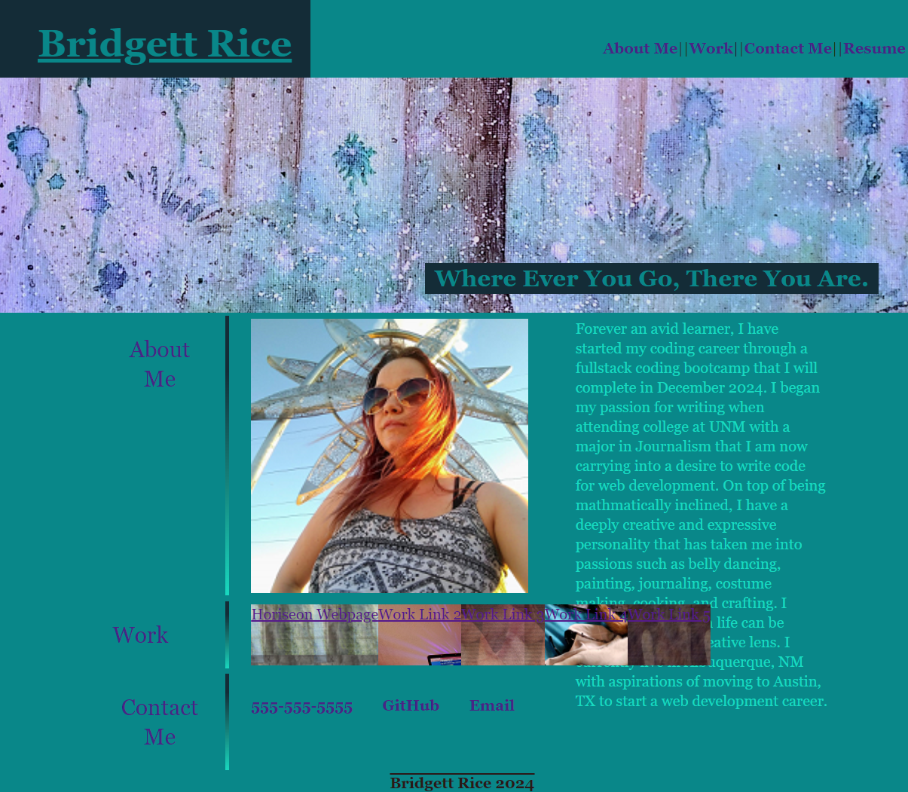

# Challenge Two Portfolio

## Description

I was given the task of doing a mock up reflecting the styles and composition found in the challenge folders GIF example inside the README.  Using Advanced CSS elements I was able to organize content and allow for links to be used in both the card elements and the navigation elements making the webpage have interactivity to meet

## Installation

N/A

## Usage

The website allow graders to see all of the HTML and CSS code written by me, as well as show the website was launched correctly and reflects the desired layout.  The github repository allows graders to see that git commands were used periodically to push gode up from a remote repository to a github repository, and also shows that a readme markdown file and a license were added to the repository using github.

Website Link: https://br1dg3tt.github.io/challenge-two-portfolio/

## Credits

Coding Classmates

## License

MIT

## Badges

N/A

## Features

N/A

## How to Contribute

N/A

## Tests

N/A